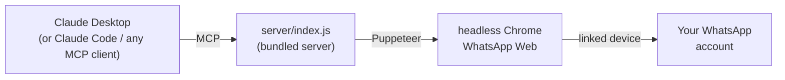

<div align="center">


# WhatsApp - OtterBridge

**Let your AI assistant read and act on the WhatsApp account you already use — chats, contacts, groups, media and polls, in plain English.**

[](#install--claude-desktop)
[](https://modelcontextprotocol.io)
[](#install--claude-desktop)
[](#install--claude-code-plugin)

[Install](#install--claude-desktop) ·
[How it works](#how-it-works) ·
[Tools](#what-your-ai-can-do) ·
[Pacing](#pacing--why-this-matters) ·
[Safety](#safety) ·
[What's in this repo](#whats-in-this-repo)

</div>

> **Unofficial client, and your account is at risk.** This drives WhatsApp Web in a
> headless browser. It is **not** Meta's WhatsApp Business Platform, is not affiliated with
> or endorsed by WhatsApp or Meta, and using it may violate WhatsApp's terms.
> **Accounts can be banned.** Use an account you can afford to lose — see [Safety](#safety).

## How it works

One bundled Node server drives a headless Chrome running WhatsApp Web, linked to your
account exactly the way WhatsApp Web on a laptop is: you scan a QR once.



Your assistant reads chats, searches history across every conversation, summarises groups,
looks up contacts, and sends messages, media, polls and locations — with sending
deliberately slowed to look human (see [Pacing](#pacing--why-this-matters)).

Everything runs **locally**. No message passes through a third-party server.

## Install — Claude Desktop

You need **Node.js 18+**, **Google Chrome** (or Chromium/Edge), and **Claude Desktop**.

**1 — Get [`otterbridge-whatsapp-mcp.mcpb`](otterbridge-whatsapp-mcp.mcpb)** — from the
latest release, or download it from this repo.

**2 — Install it** from Claude Desktop: **Settings → Extensions → Advanced settings →
Install Extension…**, then pick the `.mcpb` file. Confirm, and it appears in your
extensions as **WhatsApp - OtterBridge**.

Anthropic also documents double-clicking the file and dragging it onto the Claude Desktop
window. Both depend on Claude Desktop having claimed the `.mcpb` file type, which does not
always happen on Windows — if double-clicking does nothing, that is why. Use the menu.

**3 — Link your WhatsApp account — just ask Claude.** Say *"sign in to WhatsApp"*.

A sign-in page opens in your browser with a QR code that **refreshes itself**, so there is
no 20-second scramble. Scan it with **WhatsApp → Settings → Linked Devices → Link a
Device**. The page tells you the moment it works.

Then just say **"done"** and Claude carries on. Nothing polls or blocks in the background.

Running headless? The same code comes back as scannable ASCII art in the tool output, and
`node server/index.js --link` from the extension folder still works.

**4 — Unlock sending — just ask Claude.** Out of the box every *reading* tool works for free:
chats, search, contacts, groups, media downloads. Tools that send or change anything need an
OtterBridge licence. Say *"sign in to OtterBridge"*: a page opens in your browser, you enter
your email and the 6-digit code it sends you, and approve this computer. **New accounts get a
14-day free trial of everything.** Say **"done"** and the sending tools appear without a
restart.

Have a licence key instead (`OB-WA-XXXX-XXXX-XXXX-XXXX`)? Paste it into the extension's
**Licence key** setting, or tell Claude *"activate licence key OB-WA-…"*. Keys are for
headless machines and for licences bought without an account.

Ask Claude to run `whatsapp_license_status` at any time; it says what this computer is
entitled to and until when. `whatsapp_license_sign_out` frees the seat for another machine.

**4 — Try it:** ask Claude *"How many unread WhatsApp chats do I have?"*

<details>
<summary><b>First call is slow?</b></summary>

The first tool call after starting launches Chrome and waits for WhatsApp Web to sync —
usually 5–20 seconds, longer on a large account. Later calls are fast.
</details>

<details>
<summary><b>Troubleshooting</b></summary>

**Ask Claude to run `whatsapp_session_status` first.** It works even when nothing is
linked, and names the problem and the next step.

- **Sending tools are missing, or say "not available on the current OtterBridge licence"** —
  ask Claude to run `whatsapp_license_status`; its message says whether you need to sign in,
  the trial ended, or the machine is offline too long. Reading tools always stay available.
- **"Not signed in"** — WhatsApp sessions expire. Ask Claude to sign you in again; it will
  show a QR code. Nothing is lost.
- **"session is already in use"** — only one process can use a session at a time; Chrome
  locks the profile folder. If a previous run left its browser behind, the server now
  recognises it as its own and closes it automatically, so just try again. It will only say
  this when something is *genuinely* still running — another client, or a `--link` window.
  Close that, then retry. (It deliberately never closes a browser whose owning process is
  still alive, so it can't shut down something you are using.)
- **Claude Desktop and Claude Code each have their own sign-in.** They are separate
  installations with separate session folders, so signing in to one does not sign in the
  other — scan once for each. They are two linked devices, and WhatsApp allows four.
- **The QR never appears, or the browser shows a database error** — the stored session is
  corrupt. Ask Claude to run `whatsapp_link_reset`, then sign in again.
- **Stuck on "copying your account across"** — the initial history transfer streams from
  your phone, so the phone has to stay awake, online and running WhatsApp until it
  finishes. The sign-in page notices when progress stops and tells you what to check. If it
  stays stuck, ask Claude to reset the sign-in and scan again.
- **No browser found** — set `CHROME_PATH` to your Chrome, Chromium or Edge executable, or
  set it in the extension's settings.
- **Unlinked from your phone?** Just sign in again. Unlinking on the phone revokes the
  session immediately — which is also how you cut off access in a hurry.
</details>

## Install — Claude Code (plugin)

From a local copy of this repo — a clone, or a folder someone handed you:

```
/plugin marketplace add C:\path\to\otterbridge-whatsapp-mcp
/plugin install otterbridge-whatsapp-mcp@otterbridge
```

Or straight from git, if you have access to the repo:

```
/plugin marketplace add wen-da-ng/otterbridge-whatsapp-mcp
/plugin install otterbridge-whatsapp-mcp@otterbridge
```

`marketplace add` is not a submission to any public directory — it points Claude Code at
a folder or repo holding `.claude-plugin/marketplace.json` and reads the plugin list from
there. `otterbridge` is the marketplace name declared in that file.

Then just ask Claude to *"sign in to WhatsApp"* — a browser page opens with a
self-refreshing QR code. Scan it, say **"done"**, and you are in. (`node server/index.js
--link` from the plugin folder also still works.)

## Install — any other MCP client

Clone this repo and point the client at the bundled server. It is a plain stdio MCP server
with no install step — the runtime it needs is committed alongside it.

```json
{
  "mcpServers": {
    "whatsapp": {
      "command": "node",
      "args": ["C:/path/to/otterbridge-whatsapp-mcp/server/index.js"]
    }
  }
}
```

Add `"--read-only"` to `args` to expose only the reading tools; see [Options](#options).

## What your AI can do

**174 tools.** Everything returns JSON.

| Area | What it covers |
|---|---|
| **Chats** | List, search across all history, fetch messages, archive, pin, mute, mark unread, typing indicators |
| **Messaging** | Send text, images, video, documents, stickers, voice notes, locations, contact cards, polls |
| **Message actions** | Reply, react, edit, forward, star, pin, delete, download media, read receipts |
| **Contacts** | Look up, resolve numbers to WhatsApp ids, check registration, profile pictures, About text, shared groups, block/unblock |
| **Groups** | Create, list, membership, promote/demote admins, rename, description, picture, invite links, join requests, admin-only settings |
| **Channels** | Create, search the directory, subscribe, post, read, manage admins |
| **Sign-in** | Open a branded sign-in page with a self-refreshing QR, check status, reset a broken session |
| **Diagnostics** | Version drift, per-chat health sweep, patch verification — for when WhatsApp ships a breaking update |

Ask in plain English: *"Summarise the last 30 messages in the Vege Box Orders group"*,
*"Find every message mentioning 'invoice' this month"*, *"Send Mum a message saying I'll
call tonight"*.

### Which tools are safe

Every tool declares what it does to your account, using the MCP standard for it
(`ToolAnnotations`). Your assistant sees this before it calls anything, and clients that
support per-tool approval can use it to auto-allow the harmless ones:

| | Count | What it means |
|---|---|---|
| 🟢 **Read-only** | 68 | Looks at your account and changes nothing. Safe to call while exploring. |
| 🔵 **Writes** | 85 | Sends a message, renames a group, archives a chat. Visible to other people, but reversible. |
| 🔴 **Destructive** | 17 | Removes or invalidates something. 14 of these also carry a `[DESTRUCTIVE — cannot be undone]` warning your assistant is told to confirm with you first. |

Start with `--read-only` if you want to look before you touch — it exposes the 68 reading
tools and refuses to load the rest at all, so there is nothing to misfire.

## Pacing — why this matters

Automated accounts get banned mostly for **behaviour**: bursts, instant replies, activity
around the clock. Every outbound message is therefore paced:

1. Waits out global and per-chat cooldowns
2. Pauses 1.2–4.5 s, as if reading and thinking
3. Shows a **typing indicator** for a duration proportional to the message length
4. Clears it, then sends

Sends are serialised — overlapping sends are unmistakably automated — and every delay is
jittered, because fixed delays are themselves a machine signature.

**Ceilings:** 40 messages/hour, 200/day, and **5 new chats/hour**. Hitting one returns an
error your assistant can read, rather than queueing silently. `whatsapp_pacing_status`
reports current usage.

The new-chat ceiling is strictest on purpose: messaging people who never messaged you is
the strongest signal associated with enforcement.

**This is risk reduction, not immunity.** Nobody outside Meta knows the real thresholds.

## Safety

Read [`docs/SAFE_USE_GUIDE.md`](docs/SAFE_USE_GUIDE.md) before pointing this at an account
that matters. The short version:

- **Your account can be banned.** This is an unofficial client. Prefer a spare number.
- **The session folder is a credential.** Linking creates `.wwebjs_auth/` in your per-user
  application data — `%LOCALAPPDATA%\OtterBridge\whatsapp-mcp` on Windows,
  `~/Library/Application Support/OtterBridge/whatsapp-mcp` on macOS. Anyone who copies it
  controls your WhatsApp until you unlink the device. Keep it off shared drives and out of
  backups. To revoke: **WhatsApp → Linked Devices → log out**.
- **17 destructive tools are exposed** — delete for everyone, block, leave group, delete
  channel, clear chat. Each declares `destructiveHint` and 14 also carry a `[DESTRUCTIVE]`
  marker in the description, but a misread instruction can still fire one. Start with
  `--read-only` to look before you touch.
- **`logout` is not exposed** by default; it destroys the session. `--allow-logout` enables it.
- **Everything is local.** Claude ⇄ a local Node process ⇄ your local Chrome ⇄ WhatsApp.
  Nothing is exposed to the network.
- **One session, one process.** Chrome locks the profile directory.

## Options

| Flag / env | Effect |
|---|---|
| `--link` | Print a QR and link the account, then exit |
| `WA_DATA_PATH=…` | Where the linked session is stored. Defaults to `.wwebjs_auth` under your per-user application data (`%LOCALAPPDATA%\OtterBridge\whatsapp-mcp`, `~/Library/Application Support/OtterBridge/whatsapp-mcp`, `$XDG_DATA_HOME/otterbridge/whatsapp-mcp`). In Claude Desktop this is the **Session folder** setting |
| `WA_PROTOCOL_TIMEOUT_MS=…` | How long a single browser command may take before it errors (default 120000) |
| `--read-only` | Disable every write — read and search only |
| `--no-humanize` | Disable send pacing (not recommended) |
| `--allow-logout` | Expose `logout` |
| `WA_CLIENT_ID=name` | Name the session folder; use different values for multiple accounts |
| `CHROME_PATH=…` | Point at a specific browser if auto-detection fails |

## What's in this repo

This is the **distribution** repo — built artifacts only, no source.

```
server/index.js           the bundled MCP server (esbuild, minified)
server/node_modules/      puppeteer — it resolves files relative to its own
                          package root, so it cannot be bundled and ships as-is
otterbridge-whatsapp-mcp.mcpb   the Claude Desktop extension bundle
manifest.json             MCPB manifest the .mcpb is built from
.claude-plugin/           Claude Code plugin + marketplace manifests
.mcp.json                 Claude Code plugin server wiring
docs/SAFE_USE_GUIDE.md    risk, pacing, session security, recovery
static/                   icons
NOTICE                    third-party attribution
```

Everything here is produced by the build in a private source repo and copied in whole, so
there is nothing to patch by hand: a fix goes into the source and comes back out as a new
build.

A note on the underlying library: `whatsapp-web.js` 1.34.7 is **partially broken** against
current WhatsApp Web, which renamed an internal id field. That single change disabled chat
listing, message ids, event payloads and send return values — surfacing as six unrelated
errors. This server ships runtime patches for all of it, applied automatically on connect.
`whatsapp_diag_versions` and `whatsapp_patch_verify` are where to start when WhatsApp next
changes something.

## Licence

Proprietary — see [LICENSE](LICENSE). Third-party attribution in [NOTICE](NOTICE).

The free tier (every read-only tool) needs no account. Sending and every other write needs
an OtterBridge account or licence key; new accounts get a 14-day trial. Licensing talks to
`dmmrxqqeslmqcldqijcl.supabase.co` in the background and sends only: your sign-in
credential or licence key, a non-reversible device id, this computer's name as a label,
the product name, channel and version. Never your WhatsApp messages, contacts or session.
Tokens are verified offline and cached, so a dropped connection does not interrupt you;
after two weeks without any contact the write tools pause until it reconnects.

Not affiliated with, endorsed by, or sponsored by WhatsApp or Meta Platforms, Inc.
WhatsApp is a trademark of Meta Platforms, Inc.
